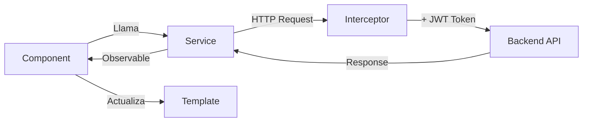

# 🍽️ MealMate - Tu Compañero Inteligente de Planificación de Comidas

<div align="center">


**Planifica • Organiza • Comparte**

[](https://angular.io/)
[](https://www.typescriptlang.org/)
[](https://tailwindcss.com/)
[](https://rxjs.dev/)

</div>

---

 **Repositorio del Backend**: [Mealmate-Backend](https://github.com/MealMate-Org/MealMate-Backend)

---

## 📋 Tabla de Contenidos

- [Sobre el Proyecto](#-sobre-el-proyecto)
- [Características Principales](#-características-principales)
- [Tecnologías Utilizadas](#-tecnologías-utilizadas)
- [Arquitectura](#-arquitectura)
- [Requisitos Previos](#-requisitos-previos)
- [Instalación y Configuración](#-instalación-y-configuración)
- [Estructura del Proyecto](#-estructura-del-proyecto)
- [Guía de Uso](#-guía-de-uso)
- [Variables de Entorno](#-variables-de-entorno)
- [Scripts Disponibles](#-scripts-disponibles)
- [API Backend](#-api-backend)
- [Contribución](#-contribución)
- [Licencia](#-licencia)

---

## 🎯 Sobre el Proyecto

**MealMate** es una aplicación web fullstack moderna que revoluciona la forma en que planificas y organizas tus comidas. Diseñada para uso personal, familiar o en grupo, MealMate combina la potencia de Angular 20 con una interfaz intuitiva y visualmente atractiva para ofrecer una experiencia completa de planificación alimentaria.

### 🌟 ¿Por qué MealMate?

- **🗓️ Planificación Semanal**: Organiza tu menú completo con vista semanal interactiva
- **🛒 Lista de Compra Inteligente**: Generación automática basada en tu planificación
- **👥 Colaboración en Tiempo Real**: Comparte planes con familia o compañeros de piso
- **📊 Control Nutricional**: Seguimiento detallado de macros y calorías
- **⚠️ Alertas de Alergias**: Sistema inteligente de detección de alérgenos
- **🌐 Comunidad de Recetas**: Descubre, comparte y guarda tus recetas favoritas

---

## ✨ Características Principales

### 🍳 Gestión de Recetas

```typescript
✅ Creación y edición de recetas personalizadas
✅ Almacenamiento de ingredientes con cantidades y unidades
✅ Instrucciones paso a paso
✅ Carga de imágenes (URL externa)
✅ Clasificación por tipo de comida (desayuno, comida, cena, aperitivo)
✅ Sistema de valoraciones y reseñas
✅ Filtrado avanzado por alérgenos y tipo de comida
✅ Recetas públicas y privadas
```

### 📅 Planificador Semanal

```typescript
✅ Vista de calendario de 7 días
✅ 3 comidas diarias configurables
✅ Resumen nutricional semanal automático
✅ Progreso visual del objetivo calórico diario
✅ Navegación entre semanas (anterior/siguiente/actual)
✅ Persistencia de datos en tiempo real
```

### 🛒 Lista de Compra

```typescript
✅ Generación automática desde el planificador
✅ Agrupación inteligente de ingredientes
✅ Marcado de items comprados
✅ Añadir items manualmente
✅ Exportación a PDF y texto
✅ Múltiples listas por semana
✅ Filtrado por listas semanales vs. manuales
```

### 💪 Control Nutricional

```typescript
✅ Configuración de objetivos personalizados
✅ Cálculo automático de macros (TMB + Factor de actividad)
✅ Seguimiento de calorías, proteínas, carbohidratos y grasas
✅ Información nutricional por receta
✅ Progreso visual semanal y diario
✅ Alertas cuando se exceden los objetivos
```

### ⚠️ Sistema de Alergias

```typescript
✅ Configuración de alérgenos personales
✅ Alertas visuales en recetas incompatibles
✅ Filtrado de recetas sin alérgenos específicos
✅ Base de datos completa de alérgenos comunes
✅ Etiquetado claro en todas las recetas
```

### 👥 Funciones Sociales

```typescript
✅ Perfiles de usuario personalizables
✅ Exploración de recetas públicas
✅ Sistema de favoritos
✅ Valoraciones de 1-5 estrellas
✅ Seguimiento de usuarios (próximamente)
✅ Grupos familiares (próximamente)
```

---

## 🛠️ Tecnologías Utilizadas

### Frontend Core

| Tecnología | Versión | Propósito |
|-----------|---------|-----------|
| **Angular** | 20.3.0 | Framework principal |
| **TypeScript** | 5.9.2 | Lenguaje de programación |
| **RxJS** | 7.8.0 | Programación reactiva |
| **Zone.js** | 0.15.0 | Detección de cambios |

### UI/UX

| Tecnología | Versión | Propósito |
|-----------|---------|-----------|
| **Tailwind CSS** | 3.4.18 | Framework de estilos utility-first |
| **PostCSS** | 8.5.6 | Procesamiento de CSS |
| **Autoprefixer** | 10.4.21 | Prefijos CSS automáticos |
| **Lucide Angular** | 0.548.0 | Iconos SVG optimizados |

### Routing & State

| Tecnología | Versión | Propósito |
|-----------|---------|-----------|
| **Angular Router** | 20.3.0 | Navegación y rutas |
| **Angular CDK** | 20.2.9 | Componentes de desarrollo |
| **Angular Forms** | 20.3.0 | Formularios reactivos |

### HTTP & API

| Tecnología | Versión | Propósito |
|-----------|---------|-----------|
| **Angular Common HTTP** | 20.3.0 | Cliente HTTP |
| **Interceptores** | Built-in | Autenticación JWT |

### Testing

| Tecnología | Versión | Propósito |
|-----------|---------|-----------|
| **Jasmine** | 5.9.0 | Framework de testing |
| **Karma** | 6.4.0 | Test runner |

### Development Tools

| Tecnología | Versión | Propósito |
|-----------|---------|-----------|
| **Angular CLI** | 20.3.6 | Herramientas de desarrollo |
| **Angular Build** | 20.3.6 | Sistema de build |
| **Prettier** | Built-in config | Formateo de código |

---

## 🏗️ Arquitectura

MealMate sigue una arquitectura modular y escalable basada en las mejores prácticas de Angular:

```
📦 MealMate Frontend
├── 🎨 Presentation Layer (Components)
│   ├── Public (Landing, Recipes List, Recipe Detail)
│   ├── Auth (Login, Register)
│   └── Private (Dashboard, Planner, Profile, etc.)
│
├── 🔧 Business Logic Layer (Services)
│   ├── AuthService (Autenticación JWT)
│   ├── RecipeService (CRUD de recetas)
│   ├── PlannerService (Gestión de planes)
│   ├── UserService (Gestión de usuarios)
│   └── ShoppingListService (Listas de compra)
│
├── 🛡️ Infrastructure Layer
│   ├── Guards (authGuard)
│   ├── Interceptors (authInterceptor)
│   └── Models (Interfaces TypeScript)
│
└── 🎭 Shared Layer
    ├── Components (Navbar, Footer)
    └── Pipes (RecipeImagePipe)
```

### Flujo de Datos



### Patrones Implementados

- ✅ **Standalone Components** (Sin NgModules)
- ✅ **Reactive Forms** (Formularios tipados)
- ✅ **Lazy Loading** (Carga diferida de rutas)
- ✅ **Dependency Injection** (Servicios singleton)
- ✅ **Observables & RxJS** (Programación reactiva)
- ✅ **JWT Authentication** (Tokens en localStorage)
- ✅ **Route Guards** (Protección de rutas)
- ✅ **HTTP Interceptors** (Inyección automática de tokens)

---

## 📋 Requisitos Previos

Antes de comenzar, asegúrate de tener instalado:

| Software | Versión Mínima | Comando de Verificación |
|----------|----------------|-------------------------|
| **Node.js** | 18.x o superior | `node --version` |
| **npm** | 9.x o superior | `npm --version` |
| **Angular CLI** | 20.x | `ng version` |
| **Git** | Cualquiera | `git --version` |

### Instalación de Angular CLI (si no lo tienes)

```bash
npm install -g @angular/cli@20
```

---

## 🚀 Instalación y Configuración

### 1️⃣ Clonar el Repositorio

```bash
git clone https://github.com/tu-usuario/mealmate-frontend.git
cd mealmate-frontend
```

### 2️⃣ Instalar Dependencias

```bash
npm install
```

Este comando instalará todas las dependencias listadas en `package.json`, incluyendo:
- Angular 20.3.0
- Tailwind CSS 3.4.18
- Lucide Angular 0.548.0
- RxJS 7.8.0
- Y todas las demás dependencias necesarias

### 3️⃣ Configurar Variables de Entorno

Crea un archivo de configuración para la API backend:

```typescript
// src/environments/environment.ts
export const environment = {
  production: false,
  apiUrl: 'http://localhost:8080/api/v1'
};

// src/environments/environment.prod.ts
export const environment = {
  production: true,
  apiUrl: 'https://tu-api.com/api/v1'
};
```

### 4️⃣ Ejecutar en Desarrollo

```bash
npm start
```

O equivalentemente:

```bash
ng serve
```

La aplicación estará disponible en `http://localhost:4200`

### 5️⃣ Compilar para Producción

```bash
npm run build
```

Los archivos compilados se generarán en la carpeta `dist/`

---

## 📁 Estructura del Proyecto

```
mealmate-frontend/
│
├── 📂 public/                          # Archivos estáticos
│   ├── MMLogo.png                      # Logo de la aplicación
│   ├── defaultProfilePicture.png       # Avatar por defecto
│   ├── defaultRecipeImage.png          # Imagen de receta por defecto
│   └── favicon.ico                     # Favicon
│
├── 📂 src/
│   ├── 📂 app/
│   │   │
│   │   ├── 📂 core/                    # Funcionalidad core
│   │   │   ├── 📂 guards/
│   │   │   │   └── auth.guard.ts       # Guard de autenticación
│   │   │   ├── 📂 interceptors/
│   │   │   │   └── auth.interceptor.ts # Interceptor JWT
│   │   │   └── 📂 services/
│   │   │       ├── auth.service.ts     # Autenticación
│   │   │       ├── recipe.service.ts   # Gestión de recetas
│   │   │       ├── planner.service.ts  # Planificador semanal
│   │   │       ├── user.service.ts     # Usuarios
│   │   │       ├── social.service.ts   # Grupos y seguimiento
│   │   │       └── user-actions.service.ts # Favoritos, ratings, listas
│   │   │
│   │   ├── 📂 features/                # Módulos funcionales
│   │   │   ├── 📂 auth/
│   │   │   │   ├── login/              # Login component
│   │   │   │   └── register/           # Register component
│   │   │   │
│   │   │   ├── 📂 public/              # Área pública
│   │   │   │   ├── landing/            # Página de inicio
│   │   │   │   ├── recipes-list/       # Explorar recetas
│   │   │   │   ├── recipe-detail/      # Detalle de receta
│   │   │   │   └── user-profile-public/ # Perfil público
│   │   │   │
│   │   │   └── 📂 private/             # Área privada (requiere login)
│   │   │       ├── dashboard/          # Dashboard principal
│   │   │       ├── planner/            # Planificador semanal
│   │   │       ├── my-recipes/         # Mis recetas
│   │   │       ├── recipe-form/        # Crear/editar receta
│   │   │       ├── saved-recipes/      # Recetas guardadas
│   │   │       ├── friends-recipes/    # Recetas de amigos
│   │   │       ├── shopping-list/      # Lista de compra
│   │   │       ├── profile/            # Mi perfil
│   │   │       └── groups/             # Grupos (próximamente)
│   │   │
│   │   ├── 📂 models/                  # Interfaces TypeScript
│   │   │   ├── recipe.model.ts         # Modelos de recetas
│   │   │   ├── user.model.ts           # Modelos de usuario
│   │   │   ├── planner.model.ts        # Modelos de planificador
│   │   │   └── social.model.ts         # Modelos sociales
│   │   │
│   │   ├── 📂 shared/                  # Componentes compartidos
│   │   │   ├── 📂 components/
│   │   │   │   ├── navbar/             # Barra de navegación
│   │   │   │   └── footer/             # Pie de página
│   │   │   └── 📂 pipes/
│   │   │       └── recipe-image.pipe.ts # Pipe para imágenes
│   │   │
│   │   ├── app.component.ts            # Componente raíz
│   │   ├── app.config.ts               # Configuración de la app
│   │   └── app.routes.ts               # Definición de rutas
│   │
│   ├── index.html                      # HTML principal
│   ├── main.ts                         # Punto de entrada
│   └── styles.css                      # Estilos globales (Tailwind)
│
├── .gitignore                          # Archivos ignorados por Git
├── angular.json                        # Configuración de Angular
├── package.json                        # Dependencias del proyecto
├── tailwind.config.js                  # Configuración de Tailwind
├── tsconfig.json                       # Configuración de TypeScript
└── README.md                           # Este archivo
```

---

## 📖 Guía de Uso

### Registro e Inicio de Sesión

1. **Registro de Usuario**
   ```
   Navega a /register
   → Completa username, email y contraseña
   → Se creará automáticamente un perfil
   → Serás redirigido al dashboard
   ```

2. **Inicio de Sesión**
   ```
   Navega a /login
   → Ingresa email y contraseña
   → Se guardará el JWT token en localStorage
   → Acceso a todas las funciones privadas
   ```

### Crear una Receta

1. Ve a **"Mis Recetas"** → **"Nueva Receta"**
2. Completa la información básica:
   - Título (obligatorio)
   - Descripción
   - Imagen (URL externa)
   - Tipo de comida
   - Visibilidad (pública/privada)
3. Añade ingredientes (nombre, cantidad, unidad)
4. Escribe las instrucciones paso a paso
5. (Opcional) Añade información nutricional
6. Selecciona alérgenos presentes
7. Guarda la receta

### Planificar la Semana

1. Ve a **"Planner"**
2. Navega a la semana deseada
3. Haz clic en "Añadir receta" en cualquier comida
4. Selecciona de tus recetas o guardadas
5. La receta se asignará automáticamente
6. Visualiza el resumen nutricional semanal
7. Genera la lista de compra con un clic

### Generar Lista de Compra

1. Desde el **Planner**, haz clic en "Generar Lista de Compra"
2. Se crearán automáticamente todos los ingredientes
3. Ve a **"Lista de Compra"**
4. Marca items conforme los compres
5. Añade items adicionales manualmente
6. Exporta a PDF o texto para llevarlo al supermercado

### Configurar Objetivos Nutricionales

1. Ve a **"Mi Perfil"**
2. En "Preferencias Nutricionales":
   - **Modo Manual**: Ingresa calorías y macros manualmente
   - **Modo Automático**: Completa edad, peso, altura, actividad y objetivo
3. El cálculo automático usa la fórmula de Mifflin-St Jeor
4. Guarda y los objetivos aparecerán en el Planner

---

## 🌐 Variables de Entorno

Aunque Angular no usa archivos `.env` tradicionales, puedes configurar variables en los archivos de entorno:

### environment.ts (Desarrollo)

```typescript
export const environment = {
  production: false,
  apiUrl: 'http://localhost:8080/api/v1',
  appName: 'MealMate',
  version: '1.0.0'
};
```

### environment.prod.ts (Producción)

```typescript
export const environment = {
  production: true,
  apiUrl: 'https://api.mealmate.com/api/v1',
  appName: 'MealMate',
  version: '1.0.0'
};
```

---

## 📜 Scripts Disponibles

| Script | Comando | Descripción |
|--------|---------|-------------|
| **Desarrollo** | `npm start` | Inicia servidor de desarrollo en puerto 4200 |
| **Build** | `npm run build` | Compila la aplicación para producción |
| **Watch** | `npm run watch` | Build en modo watch (recompilación automática) |
| **Test** | `npm test` | Ejecuta las pruebas unitarias con Karma |
| **Lint** | `ng lint` | Analiza el código (requiere configuración adicional) |

### Comandos Útiles de Angular CLI

```bash
# Generar un nuevo componente
ng generate component features/nueva-funcionalidad

# Generar un servicio
ng generate service core/services/nuevo-servicio

# Generar un guard
ng generate guard core/guards/nuevo-guard

# Analizar el bundle de producción
ng build --stats-json
npm install -g webpack-bundle-analyzer
webpack-bundle-analyzer dist/stats.json
```

---

## 🔌 API Backend

MealMate Frontend requiere un backend que implemente los siguientes endpoints:

### Authentication

```http
POST   /api/v1/auth/login
POST   /api/v1/auth/register
```

### Users

```http
GET    /api/v1/users
GET    /api/v1/users/{id}
PUT    /api/v1/users/{id}
DELETE /api/v1/users/{id}
GET    /api/v1/user-preferences/{userId}
POST   /api/v1/user-preferences
GET    /api/v1/user-allergens/{userId}
POST   /api/v1/user-allergens/{userId}
```

### Recipes

```http
GET    /api/v1/recipes
GET    /api/v1/recipes/{id}
POST   /api/v1/recipes
PUT    /api/v1/recipes/{id}
DELETE /api/v1/recipes/{id}
GET    /api/v1/allergens
GET    /api/v1/nutrition-info/{recipeId}
POST   /api/v1/nutrition-info
```

### Planner

```http
GET    /api/v1/meal-plans
GET    /api/v1/meal-plans/{id}
GET    /api/v1/meal-plans/user/{userId}
GET    /api/v1/meal-plans/user/{userId}/week
POST   /api/v1/meal-plans
PUT    /api/v1/meal-plans/{id}
DELETE /api/v1/meal-plans/{id}
GET    /api/v1/meal-plan-items
POST   /api/v1/meal-plan-items
POST   /api/v1/meal-plan-items/batch
PUT    /api/v1/meal-plan-items/{id}
DELETE /api/v1/meal-plan-items/{id}
GET    /api/v1/meal-types
```

### Shopping Lists

```http
GET    /api/v1/shopping-lists
GET    /api/v1/shopping-lists/{id}
GET    /api/v1/shopping-lists/user/{userId}
POST   /api/v1/shopping-lists
PUT    /api/v1/shopping-lists/{id}
DELETE /api/v1/shopping-lists/{id}
```

### Favorites & Ratings

```http
GET    /api/v1/favorites
GET    /api/v1/favorites/{userId}/{recipeId}
POST   /api/v1/favorites
DELETE /api/v1/favorites/{userId}/{recipeId}
GET    /api/v1/ratings
POST   /api/v1/ratings
GET    /api/v1/ratings/{recipeId}/{userId}
DELETE /api/v1/ratings/{recipeId}/{userId}
```
---

## 🎨 Personalización de Estilos

### Colores del Tema

Los colores están definidos en `tailwind.config.js`:

```javascript
colors: {
  'dark-purple': '#241623',   // Encabezados, textos importantes
  'slate-gray': '#70798c',    // Textos secundarios
  'celadon': '#a9cba6',       // Fondos suaves
  'cambridge-blue': '#7ebea3', // Primario
  'zomp': '#53a08e',          // Hover, activo
  'error': '#E63946',         // Errores, peligro
  'success': '#2A9D8F',       // Éxito, confirmación
  'background': '#F8F9FA',    // Fondo general
}
```

### Tipografía

La aplicación usa la fuente **Karla** de Google Fonts:

```css
font-family: 'Karla', sans-serif;
```

Tamaños de texto:
- `h1`: 32px
- `h2`: 28px
- `h3`: 24px
- `h4`: 20px
- `body`: 16px
- `small`: 14px

### Componentes de Tailwind Personalizados

En `styles.css` encontrarás clases personalizadas:

```css
.btn-primary     /* Botón primario azul */
.btn-secondary   /* Botón secundario verde */
.btn-accent      /* Botón de acento */
.btn-disabled    /* Botón deshabilitado */
.card            /* Tarjeta con sombra */
.input           /* Input estilizado */
.badge           /* Badge/etiqueta */
```

---

## 🧪 Testing

### Ejecutar Tests

```bash
# Todos los tests
npm test

# Tests en modo watch
ng test --watch

# Tests con cobertura
ng test --code-coverage
```

### Estructura de Tests

```typescript
// Ejemplo de test de componente
describe('RecipeDetailComponent', () => {
  let component: RecipeDetailComponent;
  let fixture: ComponentFixture<RecipeDetailComponent>;

  beforeEach(async () => {
    await TestBed.configureTestingModule({
      imports: [RecipeDetailComponent]
    }).compileComponents();
  });

  it('should create', () => {
    expect(component).toBeTruthy();
  });

  it('should load recipe on init', () => {
    // Test implementation
  });
});
```

---

## 🐛 Solución de Problemas

### Error: "Cannot find module '@angular/core'"

```bash
rm -rf node_modules package-lock.json
npm install
```

### Error: "Port 4200 is already in use"

```bash
# Usar otro puerto
ng serve --port 4300

# O matar el proceso en el puerto 4200
npx kill-port 4200
```

### Error: Tailwind no está aplicando estilos

1. Verifica que `tailwind.config.js` existe
2. Asegúrate de que `styles.css` tiene las directivas de Tailwind:
   ```css
   @tailwind base;
   @tailwind components;
   @tailwind utilities;
   ```
3. Reinicia el servidor de desarrollo

### Error: CORS al conectar con el backend

Configura CORS en tu backend para permitir `http://localhost:4200`

---

## 🤝 Contribución

¡Las contribuciones son bienvenidas! Sigue estos pasos:

### 1. Fork del Proyecto

Haz clic en el botón "Fork" en la parte superior derecha del repositorio.

### 2. Clonar tu Fork

```bash
git clone https://github.com/tu-usuario/mealmate-frontend.git
cd mealmate-frontend
```

### 3. Crear una Rama

```bash
git checkout -b feature/nueva-funcionalidad
```

### 4. Hacer Cambios

- Escribe código limpio y bien documentado
- Sigue las convenciones de Angular
- Añade tests si es posible

### 5. Commit

```bash
git add .
git commit -m "feat: añadir nueva funcionalidad"
```

Usa [Conventional Commits](https://www.conventionalcommits.org/):
- `feat:` Nueva funcionalidad
- `fix:` Corrección de bugs
- `docs:` Documentación
- `style:` Formateo
- `refactor:` Refactorización
- `test:` Tests
- `chore:` Mantenimiento

### 6. Push

```bash
git push origin feature/nueva-funcionalidad
```

### 7. Pull Request

Abre un Pull Request en GitHub con una descripción detallada de los cambios.

---

## 📄 Licencia

Este proyecto está bajo la Licencia MIT. Ver el archivo `LICENSE` para más detalles.

```
MIT License

Copyright (c) 2025 MealMate

Permission is hereby granted, free of charge, to any person obtaining a copy
of this software and associated documentation files (the "Software"), to deal
in the Software without restriction, including without limitation the rights
to use, copy, modify, merge, publish, distribute, sublicense, and/or sell
copies of the Software, and to permit persons to whom the Software is
furnished to do so, subject to the following conditions:

The above copyright notice and this permission notice shall be included in all
copies or substantial portions of the Software.

THE SOFTWARE IS PROVIDED "AS IS", WITHOUT WARRANTY OF ANY KIND, EXPRESS OR
IMPLIED, INCLUDING BUT NOT LIMITED TO THE WARRANTIES OF MERCHANTABILITY,
FITNESS FOR A PARTICULAR PURPOSE AND NONINFRINGEMENT. IN NO EVENT SHALL THE
AUTHORS OR COPYRIGHT HOLDERS BE LIABLE FOR ANY CLAIM, DAMAGES OR OTHER
LIABILITY, WHETHER IN AN ACTION OF CONTRACT, TORT OR OTHERWISE, ARISING FROM,
OUT OF OR IN CONNECTION WITH THE SOFTWARE OR THE USE OR OTHER DEALINGS IN THE
SOFTWARE.
```

---

## 👥 Autores

- **Miguel Ballesteros** - [@miguelbac](https://github.com/miguelbac)

---

<div align="center">

**⭐ Si te gusta este proyecto, dale una estrella en GitHub ⭐**

</div>
